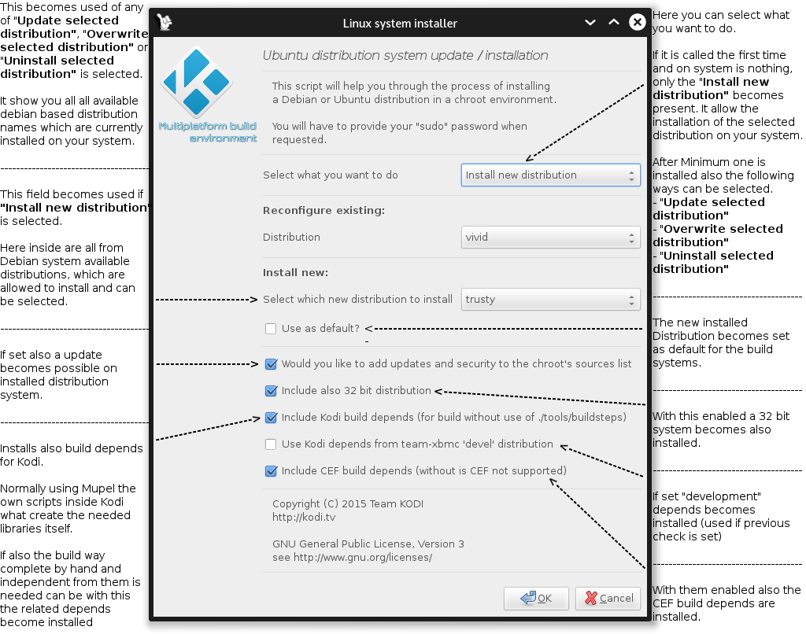
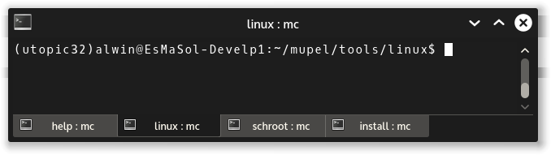
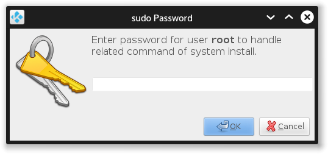
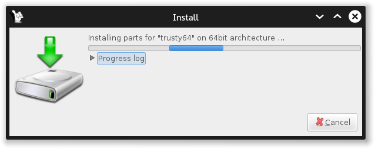
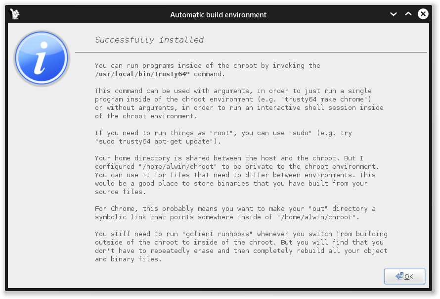

# *<p align="center">Installation of Linux x86 build systems</p>*
[](../install.md)

-------------

For the x86 build system are all currently from [Debian](https://en.wikipedia.org/wiki/Debian) or 
[Ubuntu](https://en.wikipedia.org/wiki/Ubuntu_(operating_system)) based Linux operating system and distribution 
available.

<b><i>Note:</i></b> This systems are not a normal Distribution install. It is used to allow use of others without an complete
reinstallation and this become accessed from the base only with the chroot system and easily done with a call like
<b>utopic64</b> which change to utopic on 64 bit base inside console.

Minimum one system is required for the usage of Mupel but if more as one is present can it be selected with the
settings of them.

Here comes a detailed help instructions about the installation of the build Distribution.

The installation script is present on <b>./mupel/tools/linux/install-systembuild-linux</b> which becomes called from 
the global installation <b>./mupel-install</b> and can also be called alone, further is inside Mupel itself after
installation of them a button present to open it again for changes.

The installer allow to add, update, reset or remove the selected build distributions.

*<p align="center"></p>*

--------------

If you become after start the following message dialog, is the selected Distribution still active. 
*<p align="center"></p>*

In this case check your system that no where is active. On console you have always the name on begin. If yes type only exit and is leaving chroot then.
*<p align="center"></p>*

In the case it brings it without active chroot becomes it possible to have a before wrongly removed access (e.g. Power Reset).

You can call ```utopic32 -c``` which clean the access on given name.
If it becomes called with them ```utopic32 -C``` (high "C") all active schroot systems becomes cleaned and is then
not related to the command name "utopic32" itself.

The help of the command gives you this:
```
Usage utopic32 [-h|--help] [-c|--clean] [-C|--clean-all] [-l|--list] [--] args
  help:      print this message
  list:      list all known chroot environments
  clean:     remove all old chroot sessions for "utopic32"
  clean-all: remove all old chroot sessions for all environments

```

<b><i>Note:</i></b> If you call ```utopic32``` alone is the console complete changed to them, also a single call of
a command is possible, only add it then to end e.g. ```utopic32 echo "Hello World"``` and leaves the chroot directly after them.

--------------

After the start it ask you about the <b>sudo</b> password, this is required for installation of them on your
system.
*<p align="center"></p>*

--------------

Then it becomes active with progress dialogs until it is finished.
*<p align="center"></p>*

--------------

On end it show you this which gives help about the use of them.
*<p align="center"></p>*

--------------

Everything done.
