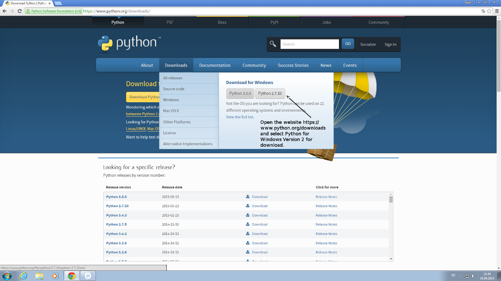
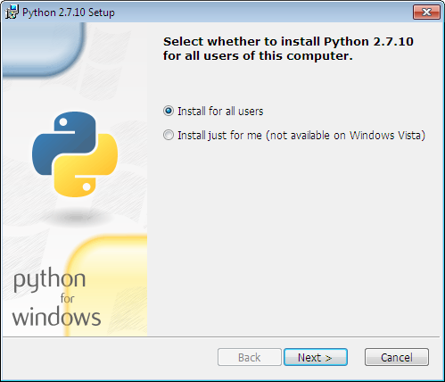
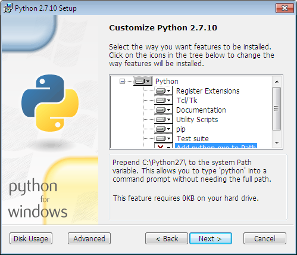
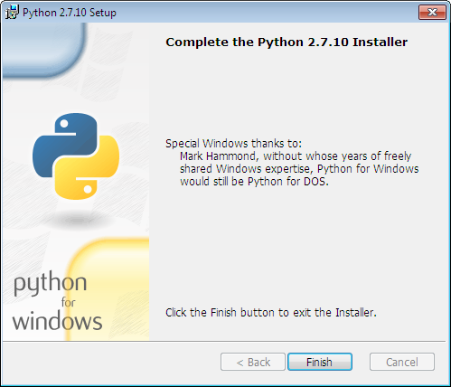

# *
Installation of Python on Windows itself
*

-------------

For the build of CEF and Google Chromium is the Windows [Python](https://www.python.org/) Version 2 required.

This can be easily installed by the following steps.

-------------

Download the required Python.
*

*
Alternative you can use from [https://www.python.org/downloads/windows/](https://www.python.org/downloads/windows/) if you want another Version.

-------------

Start installation for them.
*

*

-------------

The default variables are OK for the use with Mupel. Also is the install prefix fixed to <b>c:\Python27</b>.
If you want it on another path must you correct it inside <b>./tools/windows/bin/python.bat</b>, further if you like to add extra variables can you implement it there.
*

*

-------------

Finished installation of this dependency for CEF.
*

*
